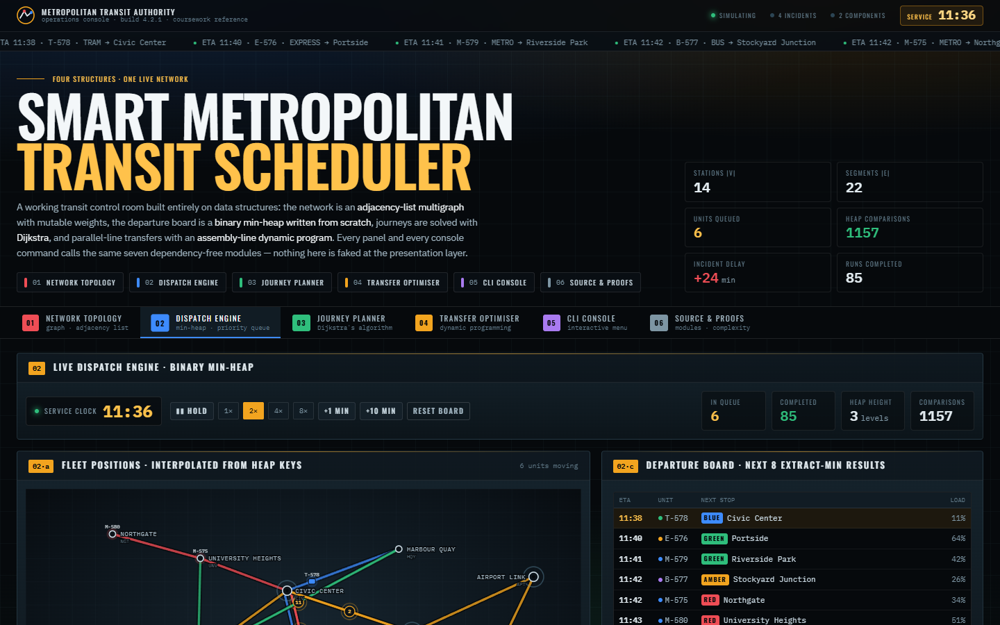
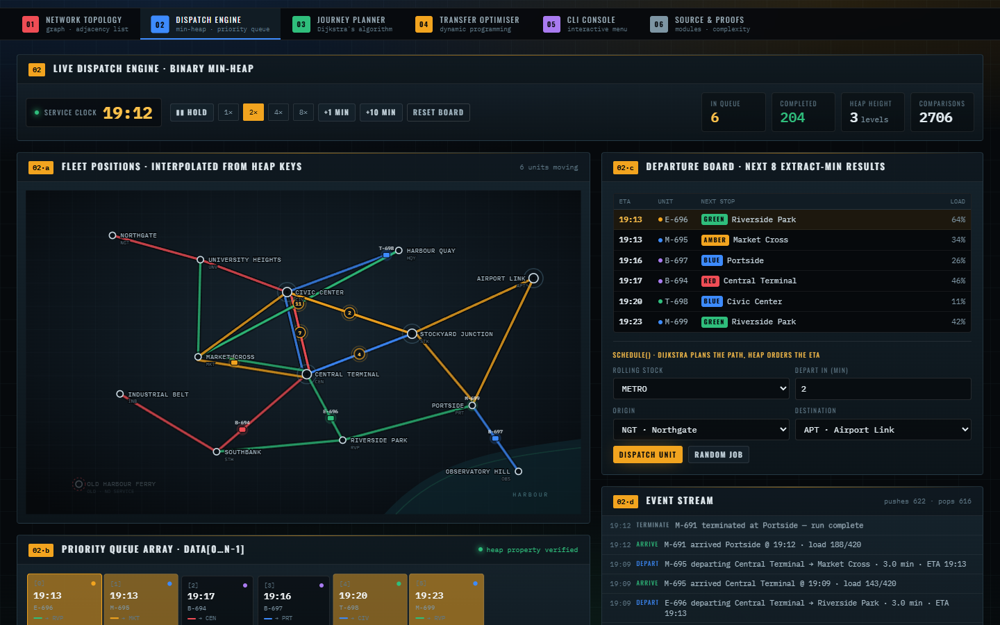
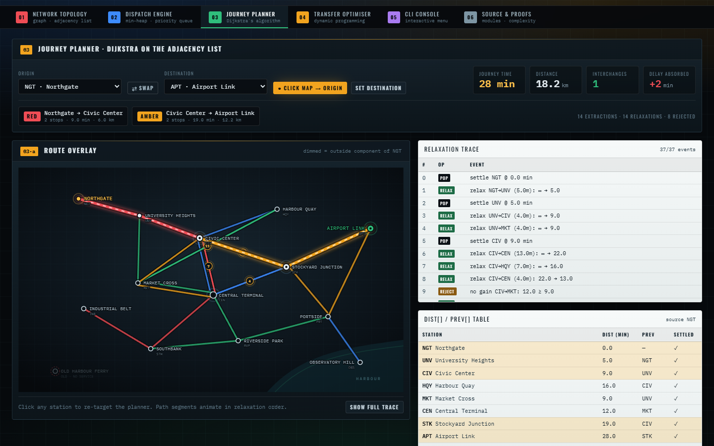
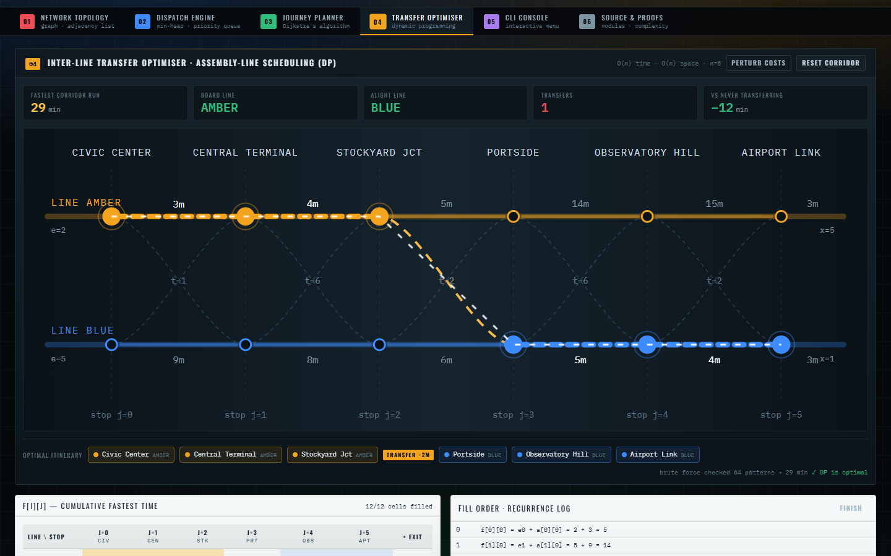
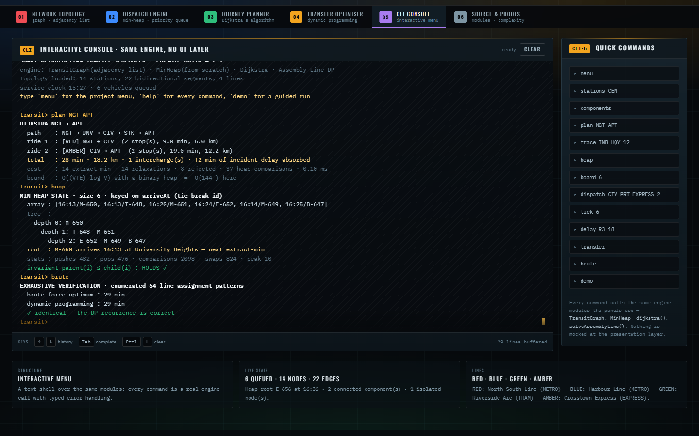
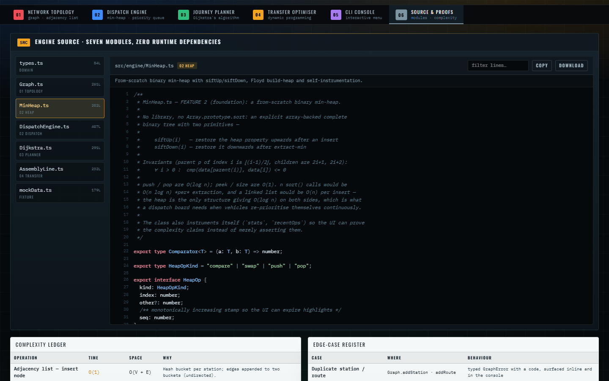
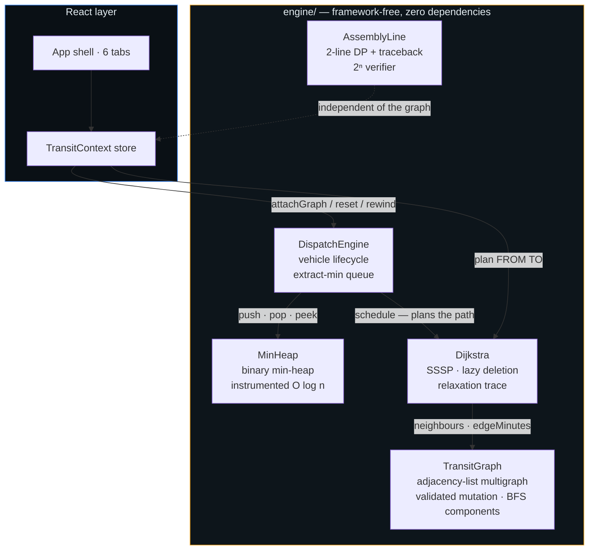

<div align="center">

# Smart Metropolitan Transit Scheduler

**A transit operations console built entirely from first-principles data structures.**
No graph library. No heap library. No pathfinding library.

[](https://www.typescriptlang.org/)
[](https://react.dev/)
[](https://vite.dev/)
[](LICENSE)

</div>



Four classical structures cooperate on one live network: an **adjacency-list multigraph**,
a **from-scratch binary min-heap**, **Dijkstra's algorithm**, and an **assembly-line
dynamic program**. Vehicles are routed with Dijkstra, ordered on the heap by ETA, and
re-plan themselves the moment an incident changes an edge weight.

---

## Contents

- [The four structures](#the-four-structures)
- [Screenshots](#screenshots)
- [Architecture](#architecture)
- [Quick start](#quick-start)
- [CLI reference](#cli-reference)
- [Edge cases handled](#edge-cases-handled)
- [How correctness is verified](#how-correctness-is-verified)
- [Tech stack](#tech-stack)

---

## The four structures

| # | Module | Structure | Complexity |
|---|--------|-----------|------------|
| 01 | **Network Topology** | weighted undirected **multigraph** as an adjacency list, `Map<StationId, Edge[]>` | O(V + E) memory, O(deg v) neighbour scan |
| 02 | **Dispatch Engine** | **binary min-heap** written from scratch — `siftUp` / `siftDown`, Floyd build-heap | push / pop **O(log n)** |
| 03 | **Journey Planner** | **Dijkstra SSSP** with lazy deletion, early exit, full relaxation trace | **O((V + E) log V)** |
| 04 | **Transfer Optimiser** | **assembly-line dynamic program** (CLRS §15.1) with a 2ⁿ brute-force oracle | **O(n)** time, O(n) space |

Edge weights are dynamic: `w(e) = baseMinutes + incidentDelay`. The network is sparse
(|E| ≈ 2·|V|), which is exactly why an adjacency list beats an adjacency matrix — O(V + E)
memory instead of O(V²).

### Why a hand-written heap?

`n` `sort()` calls would cost O(n log n) *per extraction*, and a linked list would cost
O(n) per insert. Only a binary heap gives **O(log n) on both sides**, which is what a
dispatch board needs when vehicles continuously re-prioritise themselves. The heap
instruments itself (`comparisons`, `swaps`, `pushes`, `pops`, `peakSize`) so the UI can
*prove* the complexity claims instead of merely asserting them.

---

## Screenshots

### 01 · Network topology — adjacency list with mutable weights


Click any station to dump its literal adjacency bucket. The slider mutates an edge weight
and every subsequent shortest-path query sees the new cost. Note **Old Harbour Ferry**:
a deliberately isolated node with an empty bucket, so any journey to or from it correctly
reports `found = false`.

### 02 · Dispatch engine — live multi-vehicle priority queue



The departure board is a priority queue keyed on *absolute arrival time* — "which vehicle
arrives first?" is exactly extract-min. Vehicles are drawn on the map by interpolating
between the two stations named by their heap key. The green badge is the heap invariant
re-checked on every render: `parent(i) ≤ child(i)` for all `i`.

### 03 · Journey planner — Dijkstra with a replayable trace



Every pop, relaxation, and rejection is recorded, so the algorithm can be replayed event
by event. Below it, the `dist[]` / `prev[]` table with the settled set. Stations outside
the origin's connected component are dimmed.

### 04 · Transfer optimiser — assembly-line DP



Two parallel express services along one corridor: Amber owns a fast CBD tunnel but runs
slow on-street, Blue is the mirror image. The DP fills two rows of `n` cells left to
right, traces back the optimal line assignment, and **verifies itself against exhaustive
2ⁿ enumeration** — here 64 patterns, both landing on 29 min.

### 05 · CLI console — the same engine, no UI layer



Every command is a real call into the same modules the panels use. Nothing is mocked at
the presentation layer, and typed errors surface as inline diagnostics.

### 06 · Source & proofs



The seven engine modules with a filterable, syntax-highlighted source view, plus the
complexity ledger and edge-case register.

---

## Architecture



The engine layer imports nothing from React. It is plain TypeScript (ES2020) and lifts
verbatim into a CLI binary or ports line-for-line to Python / Java / C++.

```
src/
├── engine/                 framework-free, portable
│   ├── Graph.ts            adjacency-list multigraph, validated mutation, BFS connectivity
│   ├── MinHeap.ts          binary min-heap, Floyd build-heap, self-instrumentation
│   ├── Dijkstra.ts         SSSP with lazy deletion, dist/prev tables, trace events
│   ├── AssemblyLine.ts     two-line DP with traceback + 2ⁿ exhaustive verifier
│   ├── DispatchEngine.ts   vehicle lifecycle driven by extract-min
│   ├── types.ts            domain vocabulary and effective-weight helpers
│   └── mockData.ts         14-station reference fixture (incl. an isolated node)
├── state/store.tsx         React context bridging engine ↔ UI (simulation loop)
└── components/             the six tabs plus shared UI primitives
```

---

## Quick start

```bash
npm install
npm run dev       # http://localhost:5173
npm run build     # single-file production bundle → dist/index.html
npm run preview
```

Requires Node.js 18+. The build inlines JS and CSS into one portable HTML file
(≈ 134 kB gzipped).

---

## CLI reference

```
stations [CODE]     routes [LINE]       neighbors CODE      components
add-station …       add-route …         delay ROUTE MIN     plan FROM TO
trace FROM TO [N]   heap                board [N]           dispatch FROM TO [KIND] [OFFSET]
tick [MIN]          fleet               withdraw ID         replan
transfer            brute               clock               demo
```

Type `help` for the full reference, or `demo` for a scripted walkthrough of all four
features. A few things worth trying:

```
delay R3 18         # worsen the Civic Center signal fault
plan CIV CEN        # watch the shortest path change in real time
trace INB HQY 12    # first 12 relaxation events of that search
brute               # verify the DP against all 2ⁿ transfer patterns
```

---

## Edge cases handled

| Case | Behaviour |
|------|-----------|
| Isolated station (`OLD`) | degree-0 bucket; every query to/from it returns `found = false` |
| Unreachable destination | `found = false` **plus** the reachable component, so the UI can explain *why* |
| Parallel edges (MKT–CEN on Green and Amber) | both relaxed; the cheaper one wins naturally |
| Self-loop | rejected as unroutable |
| Duplicate station / route / vehicle id | rejected with a typed `GraphError` code |
| Negative or non-finite (`NaN`) weights | rejected at the boundary — a `NaN` weight would silently poison every later query |
| Empty dispatch schedule | `pop()` returns `undefined`, `tick()` is a no-op — never throws |
| Tied arrival timestamps | tie-broken on vehicle id → deterministic, reproducible output |
| Route deleted mid-journey | vehicle re-plans from its current platform |
| Station deleted mid-journey | vehicle is held and withdrawn with a `HOLD` event instead of crashing the simulation loop |
| Midnight clock wrap | every queued vehicle's timestamps shift with the clock, keeping heap keys consistent |

---

## How correctness is verified

This project does not ask you to take its complexity claims on faith:

- **The DP checks itself.** `bruteForceAssembly()` enumerates all 2ⁿ line assignments and
  compares the optimum against the dynamic program. Both the UI and the CLI surface
  `✓ DP is optimal` or `✗ mismatch` on every run.
- **The heap checks itself.** The dispatch tab independently re-verifies
  `parent(i) ≤ child(i)` across the whole array on every render, mirroring the engine
  comparator exactly (arrival time, then vehicle id as tie-break).
- **Dijkstra reports its own work.** Extraction, relaxation, and rejection counts plus heap
  comparison/swap totals are surfaced next to every query.

The engine was additionally cross-checked externally against independent oracles:
Dijkstra ≡ Bellman-Ford on 300 random graphs, assembly DP ≡ brute force on 500 random
corridors, and the heap invariant held across 2000 random operations.

---

## Tech stack

React 19 · TypeScript (strict, `noUnusedLocals`) · Vite 7 · Tailwind CSS v4 ·
clsx + tailwind-merge. The engine layer has **zero runtime dependencies** — only
`clsx` and `tailwind-merge` exist, and both are used exclusively for class-name merging
in the UI layer.

## License

MIT — see [LICENSE](LICENSE).